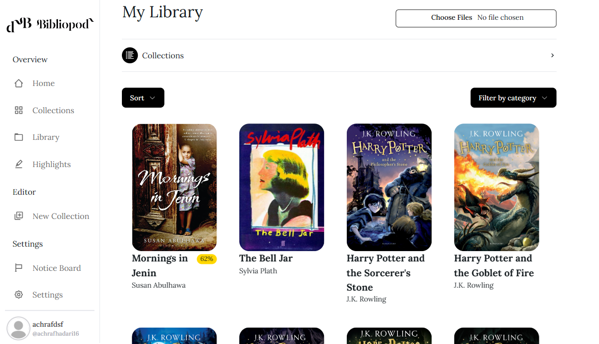

<b>Explore the World of eBooks with Our Innovative ePub Reader</b>

Immerse yourself in the captivating realm of digital literature like never before with our cutting-edge ePub reader. Seamlessly blending functionality with elegance, our platform offers a transformative reading experience tailored to your preferences.

Customized Reading Experience: Tailor your reading experience to perfection with a host of customizable features. Adjust font styles, sizes, and backgrounds to suit your comfort. From day to night mode, our reader adapts effortlessly to your environment.

  
Advanced Annotation Tools: Dive deeper into your eBooks with our advanced annotation tools. Highlight crucial passages, jot down insightful notes, and bookmark essential pages for future reference. Our intuitive interface ensures effortless organization of your annotations, making revisits a breeze.

Dynamic Content Navigation: Say goodbye to traditional page-turning. Navigate through your eBooks effortlessly with our dynamic content navigation tools. Jump to specific chapters, search for keywords, or skim through pages swiftly with our intuitive interface.

Privacy and Security: Your privacy is our top priority. Rest assured that your eBook collection remains secure and confidential with our robust privacy measures in place.

Discover a New Dimension of Reading: Embark on a journey of literary discovery with our feature-rich ePub reader. Elevate your reading experience with unparalleled customization, seamless navigation, and advanced annotation tools. Dive into your next adventure today.

